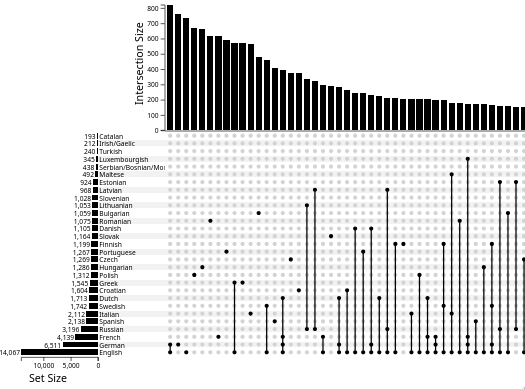

# Languages Spoken in the EU - UpSet Plot

This is an [UpSet](https://en.wikipedia.org/wiki/UpSet_plot) showing sizes of groups speaking various languages in the EU.



# Building

``` sh
npm install
# build the static application
npm run build
# precompute sets/combinations from data.json
npm run buildsets
npm run serve
```